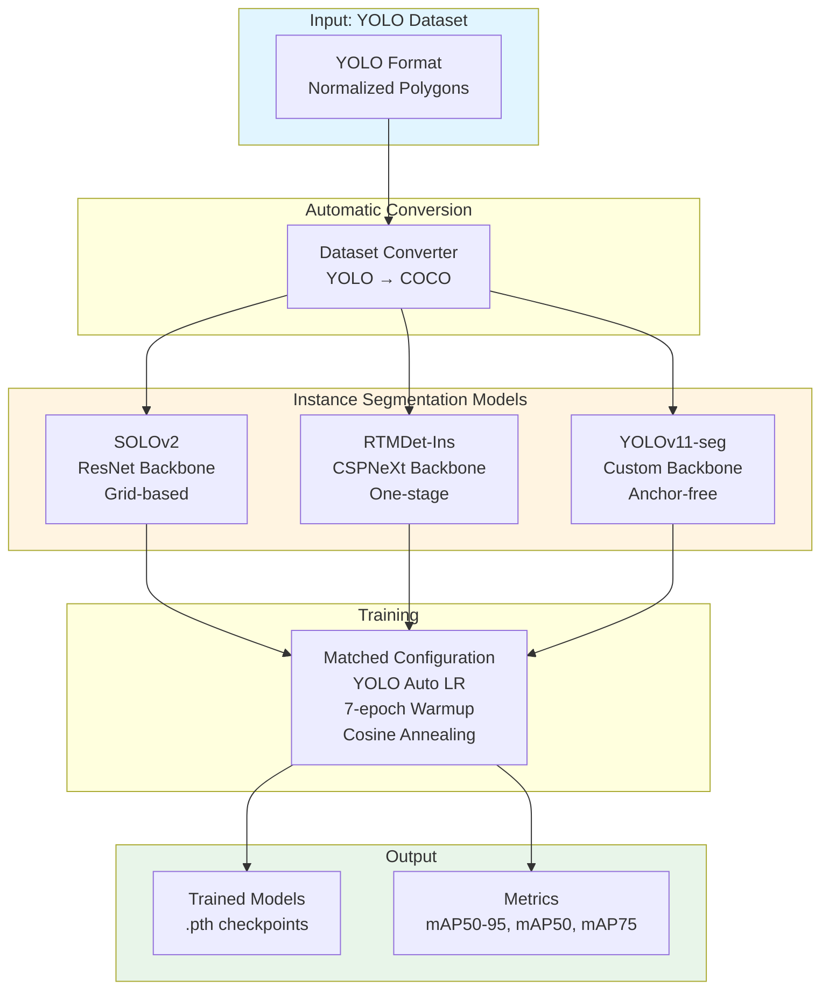
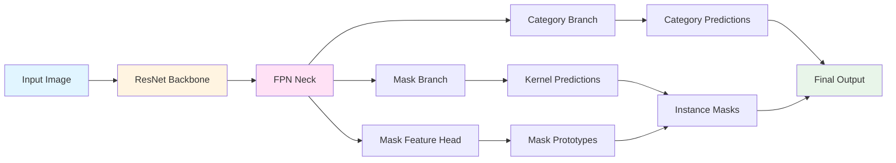
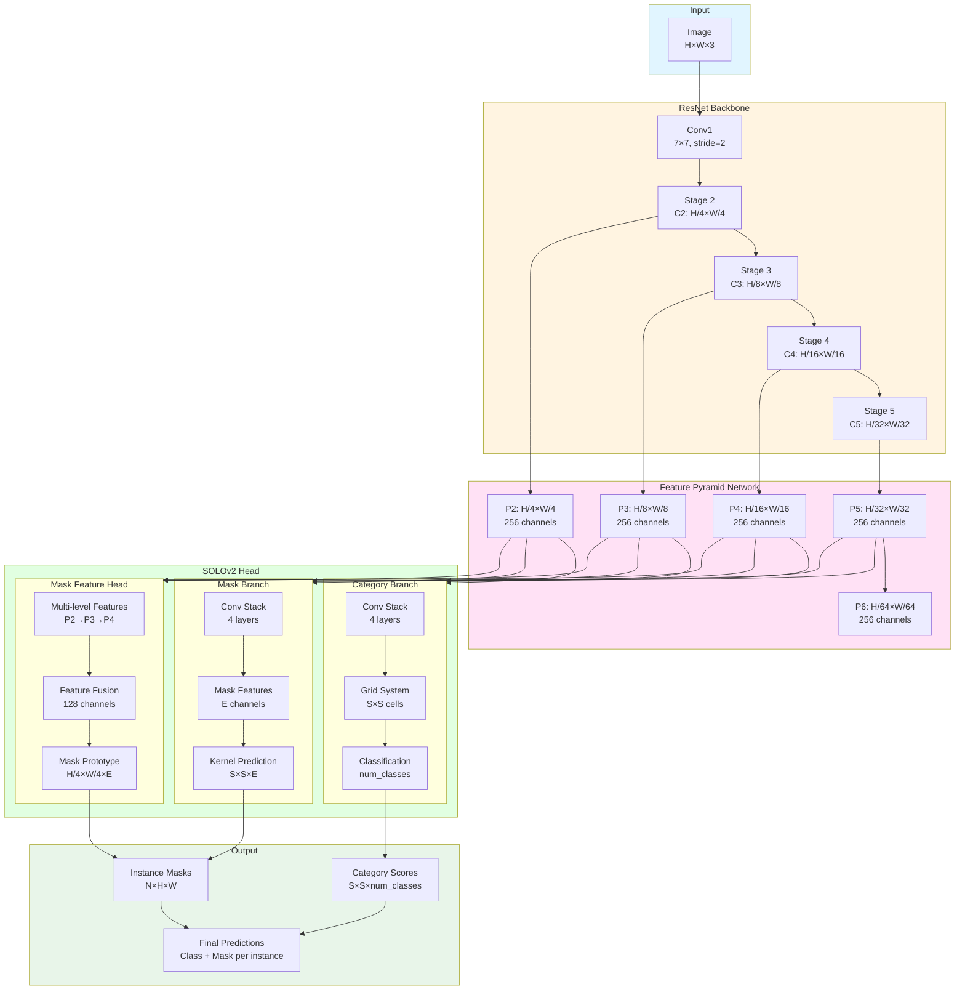
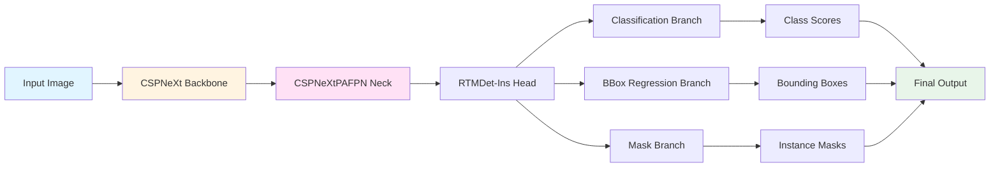
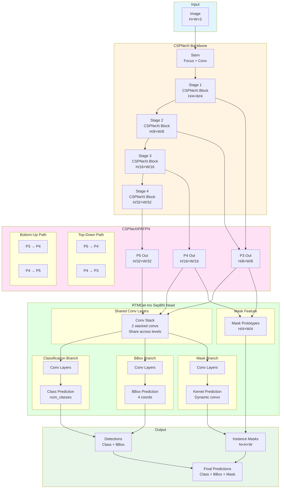
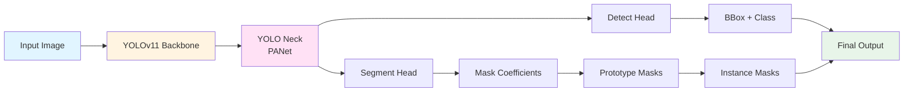
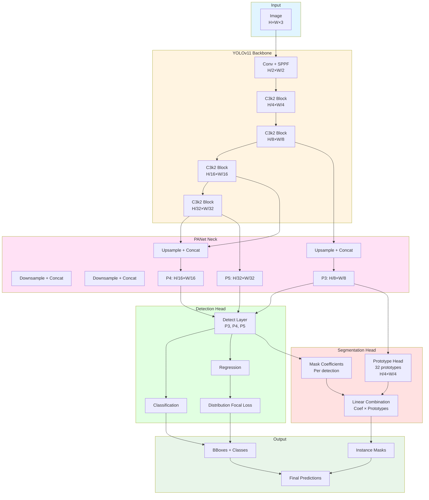

# Architecture Documentation

This document provides detailed architecture diagrams for all three instance segmentation models compared in this project.

---

## Overview: Training Pipeline

---

## SOLOv2 Architecture

**Type**: Grid-based instance segmentation
**Backbone**: ResNet (18/34/50/101)
**Key Feature**: Separate category and mask branches with spatial grid prediction

### High-Level Architecture

### Detailed Internal Architecture

### SOLOv2 Key Components

1. **ResNet Backbone**: Extracts hierarchical features at multiple scales (C2-C5)
2. **FPN Neck**: Creates feature pyramid with 256 channels per level (P2-P6)
3. **Category Branch**:
   - 4-layer conv stack
   - Grid-based classification (S×S cells)
   - Predicts object category for each grid cell
4. **Mask Branch**:
   - 4-layer conv stack
   - Predicts dynamic convolution kernels (S×S×E)
   - Each kernel generates one instance mask
5. **Mask Feature Head**:
   - Fuses P2, P3, P4 features
   - Creates mask prototypes at H/4×W/4 resolution
   - High-resolution features for precise masks

**Strengths**:
- Separate branches allow specialized learning
- Grid-based prediction enables dense instance localization
- Multi-level mask features for precise boundaries

---

## RTMDet-Ins Architecture

**Type**: One-stage anchor-free instance segmentation
**Backbone**: CSPNeXt (modern, efficient)
**Key Feature**: Shared detection and segmentation head with dynamic mask prediction

### High-Level Architecture

### Detailed Internal Architecture

### RTMDet-Ins Key Components

1. **CSPNeXt Backbone**:
   - Modern efficient architecture
   - Cross-Stage Partial connections
   - Channel attention for feature refinement
   - 4 stages with increasing receptive fields

2. **CSPNeXtPAFPN Neck**:
   - Path Aggregation FPN
   - Top-down + bottom-up fusion
   - Rich multi-scale features (P3, P4, P5)

3. **Shared Conv Layers**:
   - 2 stacked convolutions
   - Shared across all FPN levels
   - Efficient feature processing

4. **Three Prediction Branches**:
   - **Classification**: Object class scores
   - **BBox Regression**: Bounding box coordinates (DistancePointBBoxCoder)
   - **Mask Branch**: Dynamic convolution kernels for masks

5. **Mask Feature Generation**:
   - Fuses P3 and P4 features
   - Generates mask prototypes at H/4×W/4
   - Combined with dynamic kernels for final masks

6. **Dynamic Soft Label Assignment**:
   - DynamicSoftLabelAssigner with topk=13
   - Automatically assigns positive samples during training
   - No manual anchor design needed

**Strengths**:
- Modern, efficient backbone (CSPNeXt)
- One-stage design for fast inference
- Shared convolutions reduce parameters
- Dynamic label assignment for better training
- AdamW optimization for fast convergence

---

## YOLOv11-seg Architecture

**Type**: Anchor-free one-stage instance segmentation
**Backbone**: Custom CSPDarknet-based
**Key Feature**: Lightweight, ultra-fast inference

### High-Level Architecture

### Detailed Architecture

### YOLOv11-seg Key Components

1. **YOLOv11 Backbone**:
   - Custom C3k2 blocks (evolved from CSPDarknet)
   - SPPF for multi-scale receptive fields
   - Very lightweight (2.9M params for nano)

2. **PANet Neck**:
   - Path Aggregation Network
   - Bidirectional feature fusion
   - 3 output scales (P3, P4, P5)

3. **Detection Head**:
   - Anchor-free detection
   - Distribution Focal Loss (DFL) for bbox regression
   - Shared across 3 scales

4. **Segmentation Head**:
   - **Prototype-based masks**: 32 prototype masks at H/4×W/4
   - **Mask coefficients**: Each detection predicts coefficients
   - **Linear combination**: Final mask = Σ(coef_i × prototype_i)
   - Fast but less precise than kernel-based approaches

**Strengths**:
- Extremely fast inference (7x faster training)
- Smallest model (2.9M params)
- Good for real-time applications
- Prototype-based masks are efficient

**Limitations**:
- Prototype masks less precise at high IoU thresholds
- Lower mAP75 compared to SOLOv2/RTMDet-Ins
- Fixed number of prototypes (32) limits mask expressiveness

---

## Architecture Comparison

| Feature | SOLOv2 | RTMDet-Ins | YOLOv11-seg |
|---------|--------|------------|-------------|
| **Backbone** | ResNet (18/34/50/101) | CSPNeXt | Custom C3k2 |
| **Neck** | FPN | CSPNeXtPAFPN | PANet |
| **Detection** | Grid-based | Anchor-free | Anchor-free |
| **Mask Strategy** | Dynamic kernels | Dynamic kernels | Prototypes |
| **Mask Resolution** | 56×56 kernels | Dynamic convs | 32 prototypes |
| **Branches** | Separate (Cat + Mask) | Shared base + 3 heads | Detection + Seg |
| **Optimizer** | SGD | AdamW | SGD/AdamW |
| **Strengths** | Precise boundaries | Best overall | Fastest |
| **Best For** | High-precision masks | Balanced | Real-time |

### Mask Prediction Strategies

1. **SOLOv2 (Grid + Kernels)**:
   - Divides image into S×S grid
   - Each cell predicts category
   - Dynamic kernels (S×S×E) applied to mask features
   - Most precise boundaries (87.2% mAP75)

2. **RTMDet-Ins (Dynamic Kernels)**:
   - Anchor-free detection first
   - Each detection predicts dynamic conv kernel
   - Applied to shared mask features
   - Best overall consistency (75.3% mAP50-95)

3. **YOLOv11-seg (Prototypes)**:
   - Learns 32 fixed prototype masks
   - Each detection predicts coefficients
   - Linear combination of prototypes
   - Fastest but less precise (62.0% mAP50-95)

### Why SOLOv2 & RTMDet-Ins Excel

Both use **dynamic kernel prediction** which allows:
- Each instance generates custom convolution kernel
- Kernels adapted to specific object shape/size
- Higher mask expressiveness than fixed prototypes
- Better performance at high IoU thresholds

YOLOv11's prototype approach is:
- ✅ Very fast (linear combination vs. convolution)
- ✅ Efficient (only 32 prototypes to learn)
- ⚠️ Limited expressiveness (linear combination constraint)
- ⚠️ Struggles with complex shapes at high IoU

---

## Performance vs. Architecture

Results on Lingfield Racetrack (3 classes, 217 train, 99 val):

| Model | Architecture Type | mAP50-95 | mAP75 | Training Time |
|-------|------------------|----------|-------|---------------|
| **SOLOv2-nano** | Grid + Dynamic Kernels | **74.5%** | **87.2%** | 90 min |
| **RTMDet-Ins-tiny** | One-stage + Dynamic Kernels | **75.3%** | 80.6% | 85 min |
| **YOLOv11n-seg** | One-stage + Prototypes | 62.0% | ~80% | 12 min |

**Key Insight**: Dynamic kernel approaches (SOLOv2, RTMDet-Ins) achieve 12-13% higher mAP50-95 than prototype-based approach (YOLO), demonstrating the importance of mask prediction strategy.

---

