# YOLO-to-SOLOv2 Trainer

Train SOLOv2 instance segmentation models using your existing YOLO format datasets with **Ultralytics-matched augmentations and learning rate schedule**.

## Architecture

### Training Pipeline


### SOLOv2 Internal Architecture

```mermaid
graph TB
    subgraph Input["Input"]
        IMG[Image<br/>H×W×3]
    end

    subgraph Backbone["ResNet Backbone"]
        direction TB
        C1[Conv1<br/>7×7, stride=2]
        C2[Stage 2<br/>C2: H/4×W/4]
        C3[Stage 3<br/>C3: H/8×W/8]
        C4[Stage 4<br/>C4: H/16×W/16]
        C5[Stage 5<br/>C5: H/32×W/32]

        C1 --> C2
        C2 --> C3
        C3 --> C4
        C4 --> C5
    end

    subgraph FPN["Feature Pyramid Network"]
        direction TB
        P2[P2: H/4×W/4<br/>256 channels]
        P3[P3: H/8×W/8<br/>256 channels]
        P4[P4: H/16×W/16<br/>256 channels]
        P5[P5: H/32×W/32<br/>256 channels]
        P6[P6: H/64×W/64<br/>256 channels]
    end

    subgraph Head["SOLOv2 Head"]
        direction TB

        subgraph Category["Category Branch"]
            CAT1[Conv Stack<br/>4 layers]
            CAT2[Grid System<br/>S×S cells]
            CAT3[Classification<br/>num_classes]
        end

        subgraph Mask["Mask Branch"]
            MASK1[Conv Stack<br/>4 layers]
            MASK2[Mask Features<br/>E channels]
            MASK3[Kernel Prediction<br/>S×S×E]
        end

        subgraph MaskFeat["Mask Feature Head"]
            MF1[Multi-level Features<br/>P2→P3→P4]
            MF2[Feature Fusion<br/>128 channels]
            MF3[Mask Prototype<br/>H/4×W/4×E]
        end
    end

    subgraph Output["Output"]
        direction TB
        OUT1[Category Scores<br/>S×S×num_classes]
        OUT2[Instance Masks<br/>N×H×W]
        OUT3[Final Predictions<br/>Class + Mask per instance]
    end

    IMG --> C1

    C2 --> P2
    C3 --> P3
    C4 --> P4
    C5 --> P5
    P5 --> P6

    P2 --> Category
    P3 --> Category
    P4 --> Category
    P5 --> Category

    P2 --> Mask
    P3 --> Mask
    P4 --> Mask
    P5 --> Mask

    P2 --> MaskFeat
    P3 --> MaskFeat
    P4 --> MaskFeat

    CAT1 --> CAT2
    CAT2 --> CAT3
    CAT3 --> OUT1

    MASK1 --> MASK2
    MASK2 --> MASK3

    MF1 --> MF2
    MF2 --> MF3

    MASK3 --> OUT2
    MF3 --> OUT2

    OUT1 --> OUT3
    OUT2 --> OUT3

    style Input fill:#e1f5ff
    style Backbone fill:#fff4e1
    style FPN fill:#ffe1f5
    style Head fill:#e1ffe1
    style Output fill:#e8f5e9
```



## Features

- ✅ **Drop-in Replacement**: Use YOLO format datasets directly
- ✅ **4 Model Sizes**: Nano (fastest) → Large (most accurate)
- ✅ **Auto Conversion**: YOLO → COCO format conversion built-in
- ✅ **Pre-trained Backbones**: ImageNet pre-trained ResNet models
- ✅ **Ultralytics-Matched Training**:
  - YOLO's auto LR formula: `lr = 0.002 * 5 / (4 + num_classes)`
  - 7-epoch linear warmup (2% to 100%)
  - Cosine annealing to 1.7% of peak LR
  - Identical augmentation defaults (rotation ±2°, no shear/mixup)
- ✅ **Complete Augmentation Suite**:
  - **Mosaic** (100%): Custom instance-aware 4-image grid augmentation
  - **MixUp** (configurable): Image blending with alpha compositing
  - **HSV**: Color space augmentation (hue ±0.015, sat ±0.7, val ±0.4)
  - **Affine**: Rotation, translation ±10%, scale 0.5-1.5x
  - **Random brightness/contrast**: ±0.2 each
  - **Flips**: Horizontal (50%) and vertical (configurable)
- ✅ **Training Features**:
  - Best model checkpointing based on validation mAP
  - TensorBoard logging for training visualization
  - Multiprocessing data loading (4 workers)
  - Proper mask/bbox synchronization for all augmentations
- ✅ **Easy CLI**: Simple command-line interface matching Ultralytics

## Quick Start

### Installation

**Using conda:**

```bash
conda create -n solov2 python=3.11
conda activate solov2
pip install torch torchvision openmim albumentations
mim install mmengine 'mmcv>=2.0.0rc4,<2.2.0' 'mmdet>=3.0.0'
pip install pyyaml pillow tqdm
```

### Train

```bash
# Basic (nano model, 1280px, 150 epochs)
python train.py --data /path/to/data.yaml --model nano

# Custom configuration
python train.py --data /path/to/data.yaml --model small --epochs 100 --batch 8

# List available models
python train.py --list-models
```

## Model Sizes

| Model | Backbone | FPN Channels | Mask Channels | Batch | Speed | Use Case |
|-------|----------|--------------|---------------|-------|-------|----------|
| **nano** | ResNet18 | 128 | 64 | 10 | ⚡⚡⚡ | Edge devices, real-time |
| **small** | ResNet34 | 192 | 96 | 6 | ⚡⚡ | Balanced |
| **medium** | ResNet50 | 256 | 128 | 4 | ⚡ | General (default) |
| **large** | ResNet101 | 384 | 256 | 2 | 🐢 | Maximum accuracy |

## Performance

### COCO Benchmark (Official Results)

SOLOv2 official performance on COCO val2017 (80 classes, 5000 images):

| Model | Backbone | mAP | mAP50 | mAP75 | Params | FPS |
|-------|----------|-----|-------|-------|--------|-----|
| SOLOv2-Light | ResNet18 | 29.6 | 47.3 | 31.3 | 24.9M | - |
| SOLOv2 | ResNet50 | 34.8 | 55.5 | 37.2 | 46.1M | 12.1 |
| SOLOv2 | ResNet101 | 37.1 | 58.3 | 39.6 | 65.0M | 9.9 |

### Custom Dataset Results (Lingfield Racetrack)

Tested on 217 train, 99 val images, 3 classes (grass track, jumps, track) with **identical training configuration** (150 epochs, 1280px, matched augmentations and LR schedule):

#### Final Results (Epoch 150)

| Model | mAP50 | mAP50-95 | Params | Training Time |
|-------|-------|----------|--------|---------------|
| **YOLOv11n-seg** | 94.5% | **62.0%** | 2.9M | ~12 minutes |
| **SOLOv2-NANO** | **95.0%** | **75.5%** | 11.2M | ~40 minutes |

**SOLOv2 achieves 13.5% higher mAP50-95** with proper training configuration!

#### Detailed Metrics (Epoch 150)

**SOLOv2-NANO:**
- mAP@50-95: **75.5%**
- mAP@50: **95.0%**
- mAP@75: **88.9%**
- Recall: **82.6%**
- Final loss: 0.251
- Gradient norm: 3.16 (stable)

**YOLOv11n-seg:**
- mAP@50-95: 62.0%
- mAP@50: 94.5%
- mAP@75: ~80% (estimated)
- Recall: ~85%

### The Importance of Learning Rate Schedule

The key to SOLOv2's success is using **YOLO's auto optimizer formula** instead of a naive learning rate:

| Configuration | Peak LR | Warmup | Result |
|---------------|---------|--------|--------|
| **Incorrect** | 0.01 | 3 epochs (0.1% → 100%) | 26.8% mAP50-95 (gradient explosion) |
| **Correct** | 0.001429 | 7 epochs (2% → 100%) | **75.5% mAP50-95** (stable training) |

**YOLO's auto optimizer formula**: `lr = 0.002 * 5 / (4 + num_classes)`

For 3 classes: `lr = 0.002 * 5 / (4 + 3) = 0.001429`

Using the naive 0.01 LR caused:
- Gradient norm of 668 in epoch 2 (explosion!)
- Loss spiking to 58.7
- Training instability throughout
- Final mAP of only 26.8%

With the correct formula-based LR (0.001429):
- Stable gradient norms (3-35 range)
- Smooth loss convergence
- **75.5% mAP50-95** - outperforming YOLO by 13.5%

### Why SOLOv2 Excels with Proper Training

**1. More Precise Masks**
- mAP50 (IoU=0.5): Both ~95% (similar)
- **mAP50-95 (IoU=0.5-0.95)**: SOLOv2 75.5% vs YOLO 62% (+13.5%)
- SOLOv2's architecture produces tighter mask fits at higher IoU thresholds

**2. Grid-Based Prediction**
- SOLOv2's spatial grid system enables finer-grained instance localization
- Better handling of mask boundaries and overlapping regions

**3. Decoupled Heads**
- Separate category and mask branches allow specialized feature learning
- Mask feature head with multi-level fusion (P2→P3→P4)

### Ultralytics Compatibility

This implementation matches Ultralytics YOLO's training recipe for fair comparison:

**Matched Configuration:**

```yaml
# Learning Rate (CRITICAL)
lr: 0.001429  # YOLO's auto formula: 0.002 * 5 / (4 + num_classes)
warmup_epochs: 7  # Linear warmup from 2% to 100%
scheduler: cosine  # Decay to 1.7% of peak by epoch 150

# Augmentations (Default YOLO Nano)
mosaic: 1.0
mixup: 0.0
degrees: 2.0  # ±2° rotation
shear: 0.0
translate: 0.1
scale: 0.5
hsv_h: 0.015
hsv_s: 0.7
hsv_v: 0.4
fliplr: 0.5

# Training
batch_size: 10
epochs: 150
image_size: 1280
optimizer: SGD
momentum: 0.937
weight_decay: 0.0005
```

## Dataset Format

Your YOLO `data.yaml`:

```yaml
path: /path/to/dataset
train: train/images
val: valid/images
nc: 3
names: ['class1', 'class2', 'class3']
```

Directory structure:
```
dataset/
├── data.yaml
├── train/
│   ├── images/      # .jpg, .png
│   └── labels/      # .txt (normalized polygons)
└── valid/
    ├── images/
    └── labels/
```

Label format: `class_id x1 y1 x2 y2 x3 y3 ...` (normalized 0-1)

## CLI Arguments

### Basic Training

| Argument | Default | Description |
|----------|---------|-------------|
| `--data` | required | Path to data.yaml |
| `--model` | nano | nano, small, medium, large |
| `--epochs` | 150 | Training epochs |
| `--batch` | 10 | Batch size (default varies by model) |
| `--imgsz` | 1280 | Image size |
| `--lr` | auto | Learning rate (uses YOLO formula) |
| `--work-dir` | auto | Output directory |
| `--skip-conversion` | false | Skip YOLO→COCO conversion |

### Data Augmentation (Ultralytics-style defaults)

| Argument | Default | Description |
|----------|---------|-------------|
| `--mosaic` | 1.0 | Mosaic augmentation probability |
| `--mixup` | 0.0 | MixUp augmentation probability |
| `--hsv-h` | 0.015 | HSV hue augmentation (0-1) |
| `--hsv-s` | 0.7 | HSV saturation augmentation (0-1) |
| `--hsv-v` | 0.4 | HSV value/brightness augmentation (0-1) |
| `--degrees` | 2.0 | Random rotation (±degrees) |
| `--translate` | 0.1 | Random translation (±fraction) |
| `--scale` | 0.5 | Random scale range (±fraction) |
| `--shear` | 0.0 | Random shear (±degrees) |
| `--fliplr` | 0.5 | Horizontal flip probability |
| `--flipud` | 0.0 | Vertical flip probability |

**Note**: Defaults match YOLOv11n behavior for fair comparison.

## Tips

**GPU Memory Issues?**
```bash
python train.py --data data.yaml --batch 2 --imgsz 896
```

**Small Dataset (<500 images)?** Use `--model nano` or `--model small` to avoid overfitting.

**Need Speed?** Use `--model nano` for real-time inference.

**Need Maximum Accuracy?** Use `--model large --epochs 200` for best results.

**Monitor Training:**
```bash
tensorboard --logdir=work_dirs/solov2_nano
```

## Citation

```bibtex
@article{wang2020solov2,
  title={SOLOv2: Dynamic and Fast Instance Segmentation},
  author={Wang, Xinlong and Zhang, Rufeng and Kong, Tao and Li, Lei and Shen, Chunhua},
  journal={NeurIPS},
  year={2020}
}
```

## License

Apache 2.0

## Acknowledgments

This implementation uses:
- [MMDetection](https://github.com/open-mmlab/mmdetection) for SOLOv2
- [Ultralytics](https://github.com/ultralytics/ultralytics) training recipe
- [Albumentations](https://albumentations.ai/) for augmentations
