# YOLO-to-SOLOv2 Trainer

Train SOLOv2 instance segmentation models using your existing YOLO format datasets.

## Architecture

### Training Pipeline


### SOLOv2 Internal Architecture

```mermaid
graph TB
    subgraph Input["Input"]
        IMG[Image<br/>H×W×3]
    end

    subgraph Backbone["ResNet Backbone"]
        direction TB
        C1[Conv1<br/>7×7, stride=2]
        C2[Stage 2<br/>C2: H/4×W/4]
        C3[Stage 3<br/>C3: H/8×W/8]
        C4[Stage 4<br/>C4: H/16×W/16]
        C5[Stage 5<br/>C5: H/32×W/32]

        C1 --> C2
        C2 --> C3
        C3 --> C4
        C4 --> C5
    end

    subgraph FPN["Feature Pyramid Network"]
        direction TB
        P2[P2: H/4×W/4<br/>256 channels]
        P3[P3: H/8×W/8<br/>256 channels]
        P4[P4: H/16×W/16<br/>256 channels]
        P5[P5: H/32×W/32<br/>256 channels]
        P6[P6: H/64×W/64<br/>256 channels]
    end

    subgraph Head["SOLOv2 Head"]
        direction TB

        subgraph Category["Category Branch"]
            CAT1[Conv Stack<br/>4 layers]
            CAT2[Grid System<br/>S×S cells]
            CAT3[Classification<br/>num_classes]
        end

        subgraph Mask["Mask Branch"]
            MASK1[Conv Stack<br/>4 layers]
            MASK2[Mask Features<br/>E channels]
            MASK3[Kernel Prediction<br/>S×S×E]
        end

        subgraph MaskFeat["Mask Feature Head"]
            MF1[Multi-level Features<br/>P2→P3→P4]
            MF2[Feature Fusion<br/>128 channels]
            MF3[Mask Prototype<br/>H/4×W/4×E]
        end
    end

    subgraph Output["Output"]
        direction TB
        OUT1[Category Scores<br/>S×S×num_classes]
        OUT2[Instance Masks<br/>N×H×W]
        OUT3[Final Predictions<br/>Class + Mask per instance]
    end

    IMG --> C1

    C2 --> P2
    C3 --> P3
    C4 --> P4
    C5 --> P5
    P5 --> P6

    P2 --> Category
    P3 --> Category
    P4 --> Category
    P5 --> Category

    P2 --> Mask
    P3 --> Mask
    P4 --> Mask
    P5 --> Mask

    P2 --> MaskFeat
    P3 --> MaskFeat
    P4 --> MaskFeat

    CAT1 --> CAT2
    CAT2 --> CAT3
    CAT3 --> OUT1

    MASK1 --> MASK2
    MASK2 --> MASK3

    MF1 --> MF2
    MF2 --> MF3

    MASK3 --> OUT2
    MF3 --> OUT2

    OUT1 --> OUT3
    OUT2 --> OUT3

    style Input fill:#e1f5ff
    style Backbone fill:#fff4e1
    style FPN fill:#ffe1f5
    style Head fill:#e1ffe1
    style Output fill:#e8f5e9
```



## Features

- ✅ **Drop-in Replacement**: Use YOLO format datasets directly
- ✅ **4 Model Sizes**: Nano (fastest) → Large (most accurate)
- ✅ **Auto Conversion**: YOLO → COCO format conversion built-in
- ✅ **Pre-trained Backbones**: ImageNet pre-trained ResNet models
- ✅ **Ultralytics-style Augmentations**: Mosaic, MixUp, HSV, affine transforms
- ✅ **Automatic LR Scheduling**: Warmup + Cosine annealing
- ✅ **Easy CLI**: Simple command-line interface

## Quick Start

### Installation

**Option 1: Using uv (Recommended - Fast & Reproducible)**

```bash
# Install uv if you haven't already
curl -LsSf https://astral.sh/uv/install.sh | sh

# Clone and install dependencies
cd yolo-to-solov2
uv sync

# Run training
uv run python train.py --data /path/to/data.yaml
```

**Option 2: Using conda**

```bash
conda create -n solov2 python=3.11
conda activate solov2
pip install torch torchvision openmim
mim install mmengine 'mmcv>=2.0.0rc4,<2.2.0' 'mmdet>=3.0.0'
pip install pyyaml pillow tqdm
```

### Train

```bash
# Basic (medium model, 1280px, 150 epochs)
python train.py --data /path/to/data.yaml

# Custom configuration
python train.py --data /path/to/data.yaml --model small --epochs 100 --batch 8

# List available models
python train.py --list-models
```

## Model Sizes

| Model | Backbone | Channels | Batch | Speed | Use Case |
|-------|----------|----------|-------|-------|----------|
| **nano** | ResNet18 | 128 | 8 | ⚡⚡⚡ | Edge devices, real-time |
| **small** | ResNet34 | 192 | 6 | ⚡⚡ | Balanced |
| **medium** | ResNet50 | 256 | 4 | ⚡ | General (default) |
| **large** | ResNet101 | 384 | 2 | 🐢 | Maximum accuracy |

## Dataset Format

Your YOLO `data.yaml`:

```yaml
path: /path/to/dataset
train: train/images
val: valid/images
nc: 3
names: ['class1', 'class2', 'class3']
```

Directory structure:
```
dataset/
├── data.yaml
├── train/
│   ├── images/      # .jpg, .png
│   └── labels/      # .txt (normalized polygons)
└── valid/
    ├── images/
    └── labels/
```

Label format: `class_id x1 y1 x2 y2 x3 y3 ...` (normalized 0-1)

## CLI Arguments

### Basic Training

| Argument | Default | Description |
|----------|---------|-------------|
| `--data` | required | Path to data.yaml |
| `--model` | medium | nano, small, medium, large |
| `--epochs` | 150 | Training epochs |
| `--batch` | auto | Batch size (auto per model) |
| `--imgsz` | 1280 | Image size |
| `--lr` | 0.01 | Learning rate |
| `--work-dir` | auto | Output directory |
| `--skip-conversion` | false | Skip YOLO→COCO conversion |

### Data Augmentation (Ultralytics-style)

| Argument | Default | Description |
|----------|---------|-------------|
| `--mosaic` | 1.0 | Mosaic augmentation probability |
| `--mixup` | 0.1 | MixUp augmentation probability |
| `--hsv-h` | 0.015 | HSV hue augmentation (0-1) |
| `--hsv-s` | 0.7 | HSV saturation augmentation (0-1) |
| `--hsv-v` | 0.4 | HSV value/brightness augmentation (0-1) |
| `--degrees` | 10.0 | Random rotation (±degrees) |
| `--translate` | 0.1 | Random translation (±fraction) |
| `--scale` | 0.5 | Random scale range (±fraction) |
| `--shear` | 2.0 | Random shear (±degrees) |
| `--fliplr` | 0.5 | Horizontal flip probability |
| `--flipud` | 0.0 | Vertical flip probability |

**Disable augmentations:** Set probability to 0 (e.g., `--mosaic 0 --mixup 0`)

## Performance

Tested on Lingfield Racetrack dataset (217 train, 99 val):

| Model | mAP50 | mAP50-95 | Speed |
|-------|-------|----------|-------|
| SOLOv2-Medium | **89.7%** | **57.2%** | 0.3s/img |
| YOLOv11n-seg | 94.5% | 62.1% | 0.05s/img |

SOLOv2 offers better architecture for custom datasets and research flexibility via MMDetection.

## Tips

**GPU Memory Issues?**
```bash
python train.py --data data.yaml --batch 2 --imgsz 896
```

**Small Dataset (<500 images)?** Use `--model nano` or `--model small` to avoid overfitting.

**Need Speed?** Use `--model nano` for real-time inference.

**Need Accuracy?** Use `--model large --epochs 200` for best results.

## Citation

```bibtex
@article{wang2020solov2,
  title={SOLOv2: Dynamic and Fast Instance Segmentation},
  author={Wang, Xinlong and Zhang, Rufeng and Kong, Tao and Li, Lei and Shen, Chunhua},
  journal={NeurIPS},
  year={2020}
}
```

## License

Apache 2.0
